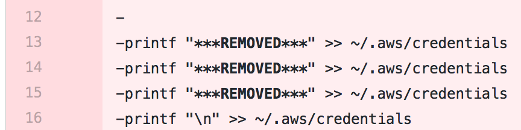

Working with AWS instances is always a hoot, especially after finding and using terraform, the service my company uses to launch instances. With terraform, access to our S3 buckets, installs of whatever extra stuff we need, health checks and more are carried out with relatively little manual labor.
However, before I found out about this, I had a g2.8xlarge instance (#humblebrag) with my neural network chugging along, and I fetched the data it needed from our S3 buckets through the miscellaneous awscli commands. However, the credentials were stored in my .aws folder, something that I exposed in my repo with the setup scripts - not a good idea. This meant that anyone inside the company could access AWS using my credentials, putting me in a lot of potential trouble.

So, to get to the point. Instead of using ``` git filter branch``` and all that mess there's this excellent tool written by [Roberto Tyley](https://github.com/rtyley/) called the [BFG repo cleaner](https://rtyley.github.io/bfg-repo-cleaner/). With this jar file I could simply feed it a text document with the regex that I wanted to clear from my repo's history, and it automatically goes through your commit history and covers up your mistakes, wherever those mistakes occur. *Sensitive information be gone! What was previously my AWS credentials is now just the string \*\*\*REMOVED\*\*\* *

It leaves the last commit to the respective file intact, so think of that if you expect it to clean those mistakes away. There's plenty of more things you can do besides clearing strings; you can also remove blobs of too big of a size, remove folders, or just remove the file completely instead of just clearing the strings. For more details and and some commands to get you started, click [here](https://rtyley.github.io/bfg-repo-cleaner/).

